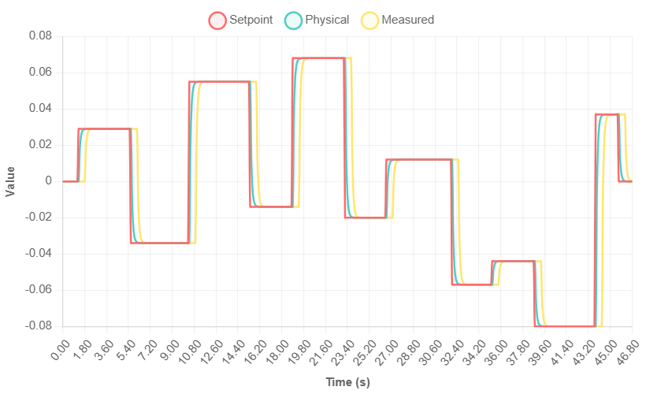
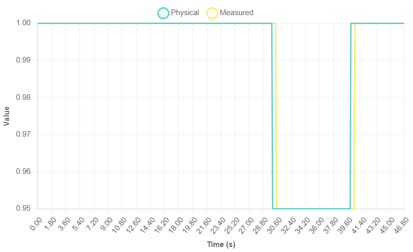
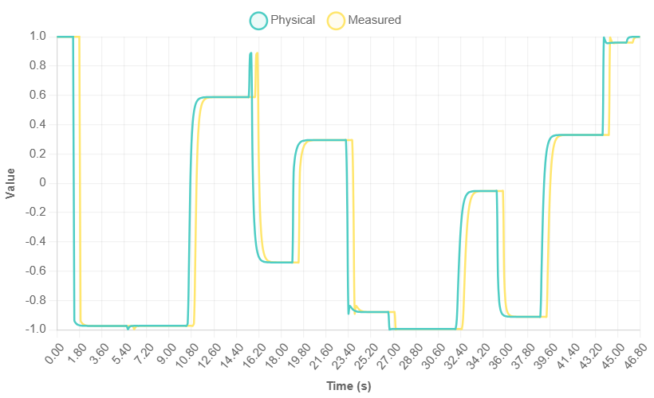

# BESS HIL Simulator


This repository contains a **Hardware-in-the-Loop (HIL) Simulator** designed for testing and validating Energy Management Systems (EMS) software. The simulator acts as a digital twin of a Power Conversion System (PCS) and Battery Energy Storage System (BESS), modeling the physical dynamics, grid coupling, and communication latencies.

It allows an external EMS to read telemetry and write setpoints via **Modbus TCP**, while the simulator runs a real-time physics engine internally.

---

## Contents

- [Plant Architecture](#plant-architecture)
- [How the HIL Works](#how-the-hil-works)
- [Quick Start](#quick-start)
- [Simulation Results](#simulation-results)
- [System Architecture](#system-architecture)
- [Configuration](#configuration)
- [Modbus Port Layout & Register Map](#modbus-port-layout--register-map)
- [Repository Layout](#repository-layout)

---

## Plant Architecture


| Component | Role |
|-----------|------|
| **BESS Physics** | Models Active ($P$) and Reactive ($Q$) power evolution using First-Order Lag dynamics (Low Pass Filter). Incorporates transport delays and capability limits. |
| **BMS/EMS Interface** | Acts as a slave device on Modbus TCP (Port 502), exposing measurements on Input Registers and accepting commands via Holding Registers. |
| **Grid Environment** | Injects grid scenarios such as voltage sags ($0.95$ pu) and swells ($1.05$ pu) to trigger dynamic capability curve adjustments. |

---

## How the HIL Works

1. The HIL starts a **Modbus TCP server** acting as the Device Under Test (EMS/PCS).
2. A real-time **physics loop** runs the physical simulator each step, integrating SoC, advancing PCS dynamics, applying P-Q limits, and applying transport delays.
3. The external EMS connects over TCP and reads/writes Modbus registers to dispatch the BESS.

---

## Quick Start

### Prerequisites

- [.NET 8 SDK](https://dotnet.microsoft.com/download)
- A Modbus TCP master to connect (your EMS, QModMaster, or the included `ModbusClient.py`)

### Build & Run

```bash
git clone https://github.com/tsoun/bess-hil-simulator.git
cd bess-hil-simulator
dotnet build

# Run the simulator
dotnet run --project BessSim.Hil/BessSim.Hil.csproj
```

Run the simulator with administrative privileges (required to bind to Port 502).

> **Note:** If Port 502 is blocked, modify `ModbusServerWrapper.Start(502)` in `Program.cs` to use port `5020`.

### Mock EMS Validation

To quickly validate the Modbus interface, run the included Python script in a separate terminal:

```bash
pip install pymodbus
python scripts/ModbusClient.py
```

### Running with Docker

```bash
docker build -t bess-hil-simulator:local .
mkdir -p data
docker run --rm --user "$(id -u):$(id -g)" -p 5020:502 -v "$PWD/data:/data" bess-hil-simulator:local
```

---

## Simulation Results

The following plots demonstrate the simulator's behavior using a **Sungrow ST5015UX PCS-ESU** model.

### Power Response Characteristics

*Active Power (P) tracking setpoint with first-order lag dynamics*


*Reactive Power (Q) response showing similar lag characteristics*


### Grid Parameters & Derived Measurements

*Grid voltage profile during simulation*


*System frequency measurements*


*Resulting power factor calculated from P and Q measurements*


*Calculated current injected to/absorbed by the grid*


---

## System Architecture

### Mathematical Model
The system uses a discrete-time state-space representation.

#### 1. State Vector ($x$)
$x(k) = \begin{bmatrix} P_{phys}(k) \\ Q_{phys}(k) \\ V_{grid}(k) \\ f_{grid}(k) \end{bmatrix}^T$

#### 2. Input Vector ($u$)
$u(k) = \begin{bmatrix} P_{setpoint}(k) \\ Q_{setpoint}(k) \end{bmatrix}^T$

#### 3. Output Vector ($y$)
To simulate realistic SCADA feedback, a transport delay $N$ is applied to the physical states. The output seen by the EMS includes additional BESS state parameters:

$y(k) = \begin{bmatrix} P_{meas}(k) \\ Q_{meas}(k) \\ PF_{meas}(k) \\ V_{meas}(k) \\ f_{meas}(k) \\ I_{meas}(k) \\ Avail_{meas}(k) \\ SOC_{meas}(k) \\ SOH_{meas}(k) \\ Temp_{meas}(k) \end{bmatrix} = \mathcal{H}(x_{extended}(k-N))$

---

## Configuration

Simulation parameters are configurable via `sim-config.json` and system designs:

| Parameter | Default | Description |
| :--- | :--- | :--- |
| **GranularityMs** | 100 ms | Simulation Step Size ($T_s$) |
| **TotalDelayMs** | 500 ms | Physics to Feedback latency ($T_{delay}$) |
| **P Time Constant ($\tau_P$)** | 0.1 s | Active Power Response Lag |
| **Q Time Constant ($\tau_Q$)** | 0.2 s | Reactive Power Response Lag |
| **Max Apparent Power ($S_{max}$)** | 0.21 MVA | Inverter Capacity Limit |
| **Battery Capacity ($E_{max}$)** | 0.21 MWh | Simulated Battery Storage Capacity |

---

## Modbus Port Layout & Register Map

The simulator listens on **Port 502** (Unit ID 1). Data is stored as **32-bit Floating Point** values.

| Signal | Type | Register Type | Address (Offset) | Description |
| :--- | :--- | :--- | :--- | :--- |
| **Setpoint P** | Float | Holding (RW) | 40001 (0) | Active Power Command |
| **Setpoint Q** | Float | Holding (RW) | 40003 (2) | Reactive Power Command |
| **Meas P** | Float | Input (RO) | 30001 (0) | Active Power Feedback |
| **Meas Q** | Float | Input (RO) | 30003 (2) | Reactive Power Feedback |
| **Meas V** | Float | Input (RO) | 30005 (4) | Grid Voltage |
| **Meas F** | Float | Input (RO) | 30007 (6) | Grid Frequency |
| **Meas I** | Float | Input (RO) | 30009 (8) | Current (Derived) |
| **Available** | Float | Input (RO) | 30011 (10) | Ready State |
| **Meas SOC** | Float | Input (RO) | 30013 (12) | State of Charge (%) |
| **Meas SOH** | Float | Input (RO) | 30015 (14) | State of Health (%) |
| **Meas Temp** | Float | Input (RO) | 30017 (16) | Cell Temperature (°C) |

---

## Repository Layout

* **`BessSim.Hil/`**: Modbus server and Console Application (entry point).
* **`BessSim.Core/`**: BESS physical dynamics, PQ capability curves, and numerical integrators.
* **`BessSim.Tests/`**: xUnit testing suite.
* **`pq-curves.json`**: PQ capability data map.
* **`scripts/`**: Includes `ModbusClient.py` for testing Modbus integration.
