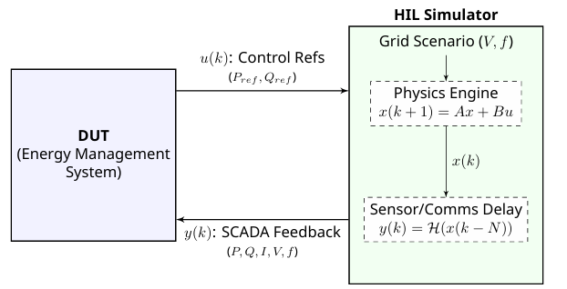
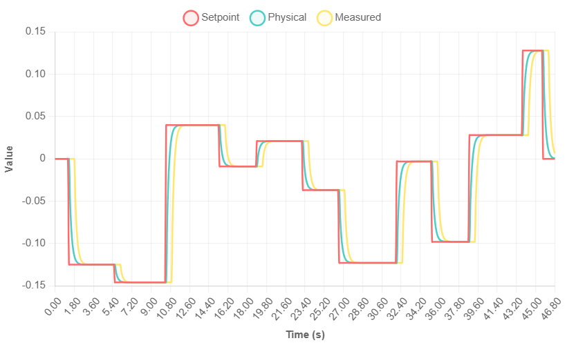
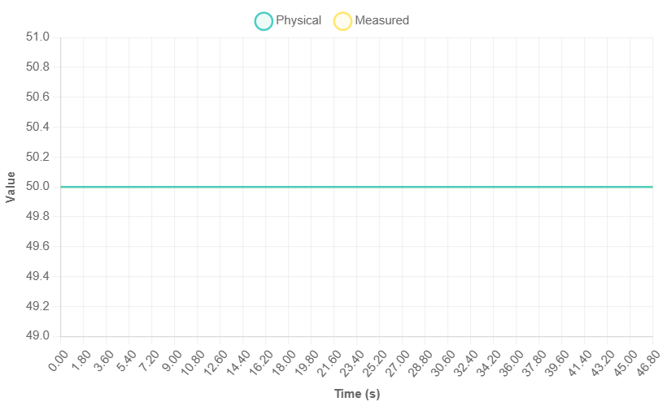
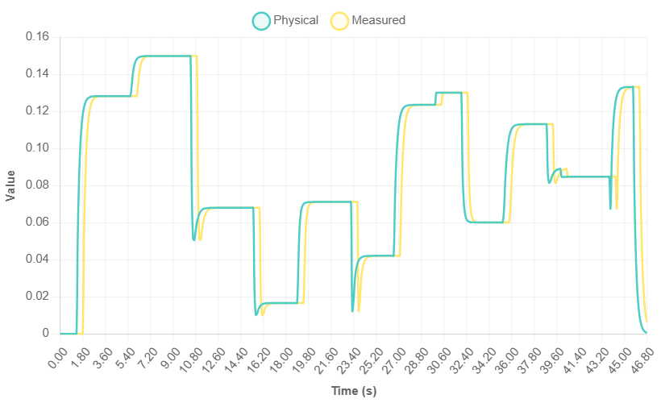

# BESS HIL Simulator

## Overview

This repository contains a **Hardware-in-the-Loop (HIL) Simulator** designed for testing and validating Energy Management Systems (EMS) software. The simulator acts as a digital twin of a Power Conversion System (PCS) and Battery Energy Storage System (BESS), modeling the physical dynamics, grid coupling, and communication latencies.

It allows an external EMS to read telemetry and write setpoints via **Modbus TCP**, while the simulator runs a real-time physics engine internally.

## Simulation Results

The following plots demonstrate the simulator's behavior using a **Sungrow ST5015UX PCS-ESU** model with the configuration:
- **Sampling Time**: 100ms
- **Measurement Latency**: 500ms  
- **P Time Constant**: 0.1s
- **Q Time Constant**: 0.2s
- **Max Apparent Power**: 0.21 MVA

### Power Response Characteristics

*Active Power (P) tracking setpoint with first-order lag dynamics*

*Reactive Power (Q) response showing similar lag characteristics*
 

### Grid Parameters & Derived Measurements

*Grid voltage profile during simulation*

*System frequency measurements*

*Resulting power factor calculated from P and Q measurements*

*Calculated current injected to/absorpted by the grid*

## Features

* **Real-Time Physics Engine:** Models Active ($P$) and Reactive ($Q$) power evolution using First-Order Lag dynamics (Low Pass Filter).
* **Transport Delay Simulation:** Simulates realistic SCADA/metering delays ($N$ steps) to test EMS feedback loops.
* **Modbus TCP Server:** Acts as a slave device (Port 502), exposing measurements on Input Registers and accepting commands via Holding Registers.
* **P-Q Capability Curve:** Implements complex saturation logic where reactive power limits ($Q_{max}/Q_{min}$) float dynamically based on grid voltage and active power levels.
* **Grid Scenarios:** Includes a scenario generator that injects voltage sags ($0.95$ pu) and swells ($1.05$ pu) to trigger capability curve changes.
* **Web-Based Data Viewer:** A standalone `viewer.html` tool to visualize `BessData.csv` logs with interactive charts and zoom capabilities.

## System Architecture

The interaction between the Device Under Test (EMS) and the Simulator is cyclic:
1.  **EMS** sends control references ($u$) via Modbus.
2.  **Simulator** evolves internal physics state ($x$) based on time constants.
3.  **Simulator** returns delayed feedback measurements ($y$) to the EMS.

### Mathematical Model
The system uses a discrete-time state-space representation.

#### 1. State Vector ($x$)
The state vector represents the physical state of the plant at the inverter terminals:

$$
x(k) = \begin{bmatrix} P_{phys}(k) \\ Q_{phys}(k) \\ V_{grid}(k) \\ f_{grid}(k) \end{bmatrix}^T
$$

#### 2. Input Vector ($u$)
The input vector consists of the setpoints received from the EMS:

$$
u(k) = \begin{bmatrix} P_{setpoint}(k) \\ Q_{setpoint}(k) \end{bmatrix}^T
$$

#### 3. State Evolution Equation
The discrete-time dynamics are modeled as a 1st-order lag for Power, while Voltage and Frequency are scenario-driven inputs:

$$
x(k+1) = A_d x(k) + B_d u(k) + E_{scenario} w_{scenario}(k)
$$

Where the system matrices are defined as:

$$
A_d = \begin{bmatrix}
e^{-T_s/\tau_P} & 0 & 0 & 0 \\
0 & e^{-T_s/\tau_Q} & 0 & 0 \\
0 & 0 & 0 & 0 \\
0 & 0 & 0 & 0
\end{bmatrix}
$$

$$
B_d = \begin{bmatrix}
1 - e^{-T_s/\tau_P} & 0 \\
0 & 1 - e^{-T_s/\tau_Q} \\
0 & 0 \\
0 & 0
\end{bmatrix}
$$

$$
E_{scenario} = \begin{bmatrix}
0 & 0 \\
0 & 0 \\
1 & 0 \\
0 & 1
\end{bmatrix}
\quad
w_{scenario}(k) = \begin{bmatrix}
V_{grid}^{*(k)} \\
f_{grid}^{*(k)}
\end{bmatrix}
$$

#### 4. Output Vector ($y$)
To simulate realistic SCADA feedback, a transport delay $N = T_{delay} / T_s$ is applied to the physical states. The output seen by the EMS includes additional BESS state parameters:

$$y(k) = \begin{bmatrix} 
P_{meas}(k) \\
Q_{meas}(k) \\
PF_{meas}(k) \\
V_{meas}(k) \\
f_{meas}(k) \\
I_{meas}(k) \\
Avail_{meas}(k) \\
SOC_{meas}(k) \\
SOH_{meas}(k) \\
Temp_{meas}(k)
\end{bmatrix} = \mathcal{H}(x_{extended}(k-N))$$

Where current $I_{meas}$ is derived non-linearly as $I_{meas} = \frac{\sqrt{P_{meas}^2 + Q_{meas}^2}}{V_{meas}}$.

#### 5. State of Charge (SOC) Dynamics & Derating
The State of Charge ($SOC$) is integrated at each step using the active power state ($P_{phys}$) and charge/discharge efficiencies:

$$SOC(k+1) = SOC(k) - \frac{\Delta E(k)}{E_{max}} \times 100\%$$

Where the energy step $\Delta E(k)$ (in MWh) accounts for one-way efficiency:

$$\Delta E(k) = \begin{cases} 
\frac{P_{phys}(k) T_s}{3600 \eta_d} & \text{if } P_{phys}(k) \ge 0 \text{ (Discharge)} \\
P_{phys}(k) T_s \eta_c / 3600 & \text{if } P_{phys}(k) < 0 \text{ (Charge)}
\end{cases}$$

To protect the battery, active power commands are clamped prior to the P-Q capability curve based on the current $SOC$:
- **Discharging (Injection, $P > 0$)**: Clamped to 0 if $SOC \le SOC_{floor}$.
- **Charging (Absorption, $P < 0$)**: Tapered linearly to 0 once $SOC > SOC_{ceiling}$:
  $$P_{max\_abs} = S_{max} \times \left(1 - \frac{SOC - SOC_{ceiling}}{100 - SOC_{ceiling}}\right)$$

## Project Structure

* **`Program.cs`**: The main entry point. Initializes the model, starts the Modbus server, and runs the real-time simulation loop.
* **`BessPhysicsModel.cs`**: Encapsulates the physics engine, IIR filters, and delay buffers (Queues).
* **`ModbusServerWrapper.cs`**: Wraps the `NModbus` logic to handle register mapping and TCP connections.
* **`PqCapabilityCurve.cs`**: Handles the complex saturation logic and interpolation between voltage levels (0.9pu to 1.1pu).
* **`viewer.html`**: A frontend tool for analyzing simulation CSV logs.
* **`BessData.csv`**: The output log file generated during simulation.

## Getting Started

### Prerequisites
* .NET 6.0 SDK or later.
* A Modbus TCP Client (e.g., QModMaster) or an actual EMS to act as the Master.
* Modern Web Browser (for `viewer.html`).

### Installation
1.  Clone the repository.
2.  Open the solution in Visual Studio or VS Code.
3.  Restore NuGet packages (specifically `NModbus`).

### Running the Simulator
Run the application with administrative privileges (required to bind to Port 502).

    dotnet run

> **Note:** If Port 502 is blocked or in use, modify `ModbusServerWrapper.Start(502)` in `Program.cs` to use port `5020`.

### Running with Docker
Build the container image from the repository root:

    docker build -t bess-hil-simulator:local .

Run the simulator in headless mode and expose the container's Modbus TCP port on
host port `5020`:

    mkdir -p data
    docker run --rm --user "$(id -u):$(id -g)" -p 5020:502 -v "$PWD/data:/data" bess-hil-simulator:local

The Docker image defaults to `BESS_HIL_CONSOLE=false`, so it does not start the
interactive console input thread. To use console control in Docker, enable it and
allocate a TTY:

    docker run --rm -it --user "$(id -u):$(id -g)" -e BESS_HIL_CONSOLE=true -p 5020:502 -v "$PWD/data:/data" bess-hil-simulator:local

The simulator writes `BessData.csv` to the mounted `data` directory and copies the
default `pq-curves.json` there if it is missing. Use `-p 502:502` instead if the EMS
must connect to the standard Modbus TCP port and your host allows binding to port 502.

Open `viewer.html` locally and select `data/BessData.csv` with **Load CSV File** to
inspect the generated log.

## Usage

### 1. Console Control
You can manually inject setpoints directly via the console window to test step responses without an EMS.

**Format:** `P[MW] Q[MVAR]`

    Enter command (P Q) or 'exit': 1.0 0.5
    >>> Command queued: P=1.00 MW, Q=0.50 MVAR

Disable console input for headless Modbus-only runs with either option:

    dotnet run -- --no-console
    BESS_HIL_CONSOLE=false dotnet run

When console input is disabled, the simulator does not start the `ReadInput` thread.

### 2. Modbus Interface (EMS Connection)
The simulator listens on **Port 502** (Unit ID 1). Data is stored as **32-bit Floating Point** values (spanning 2 registers each).

| Signal | Type | Register Type | Address (Offset) | Description |
| :--- | :--- | :--- | :--- | :--- |
| **Setpoint P** | Float (32-bit) | Holding (RW) | 40001 (0) | Active Power Command |
| **Setpoint Q** | Float (32-bit) | Holding (RW) | 40003 (2) | Reactive Power Command |
| **Meas P** | Float (32-bit) | Input (RO) | 30001 (0) | Active Power Feedback |
| **Meas Q** | Float (32-bit) | Input (RO) | 30003 (2) | Reactive Power Feedback |
| **Meas V** | Float (32-bit) | Input (RO) | 30005 (4) | Grid Voltage |
| **Meas F** | Float (32-bit) | Input (RO) | 30007 (6) | Grid Frequency |
| **Meas I** | Float (32-bit) | Input (RO) | 30009 (8) | Current (Derived) |
| **Available** | Float (32-bit) | Input (RO) | 30011 (10) | Ready State (1.0 = Available, 0.0 = Down) |
| **Meas SOC** | Float (32-bit) | Input (RO) | 30013 (12) | State of Charge (%) |
| **Meas SOH** | Float (32-bit) | Input (RO) | 30015 (14) | State of Health (%) |
| **Meas Temp** | Float (32-bit) | Input (RO) | 30017 (16) | Cell Temperature (°C) |

### 3. Data Visualization
1.  Let the simulation run; it logs data to `BessData.csv` in real-time.
2.  Open `viewer.html` in your browser.
3.  Click **Load CSV File** and select the generated `BessData.csv` or `data/BessData.csv` when running with Docker.
4.  Use the tabs to view **Charts**, **Summary Stats**, and **Data Tables**.

## Configuration

Key simulation parameters are defined in `Program.cs` and derived from the system design:

| Parameter | Value | Description |
| :--- | :--- | :--- |
| **Sampling Time ($T_s$)** | 0.1 s | Simulation Step Size |
| **Total Delay ($T_{delay}$)** | 0.5 s | Physics to Feedback latency |
| **P Time Constant ($\tau_P$)** | 0.1 s | Active Power Response Lag |
| **Q Time Constant ($\tau_Q$)** | 0.2 s | Reactive Power Response Lag |
| **Max Apparent Power ($S_{max}$)** | 0.21 MVA | Inverter Capacity Limit |
| **Battery Capacity ($E_{max}$)** | 0.21 MWh | Simulated Battery Storage Capacity |
| **SOC Discharge Floor ($SOC_{floor}$)** | 5.0 % | SOC threshold below which discharge is blocked |
| **SOC Charge Ceiling ($SOC_{ceiling}$)** | 95.0 % | SOC threshold above which charge limits taper |
| **Charge Efficiency ($\eta_c$)** | 97.0 % | Efficiency parameter for charging |
| **Discharge Efficiency ($\eta_d$)** | 97.0 % | Efficiency parameter for discharging |
